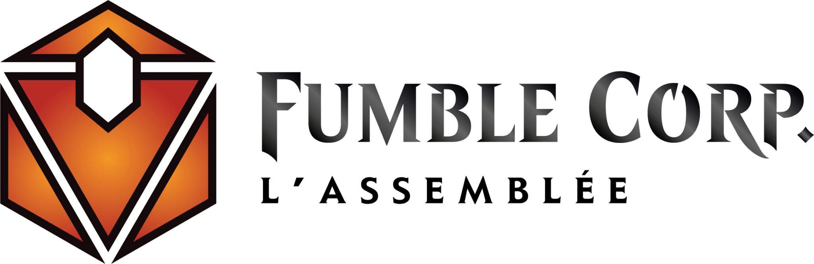
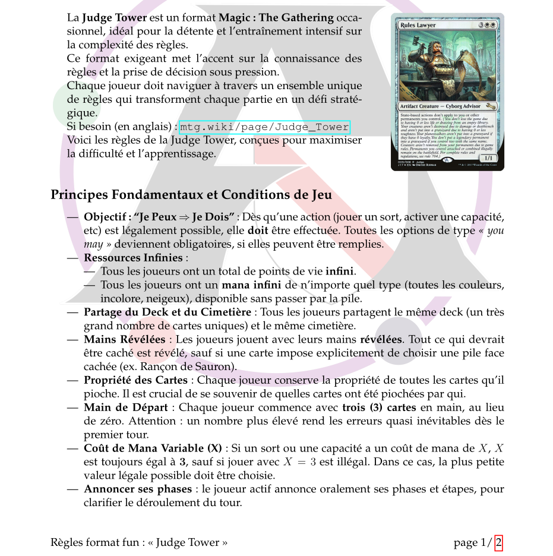
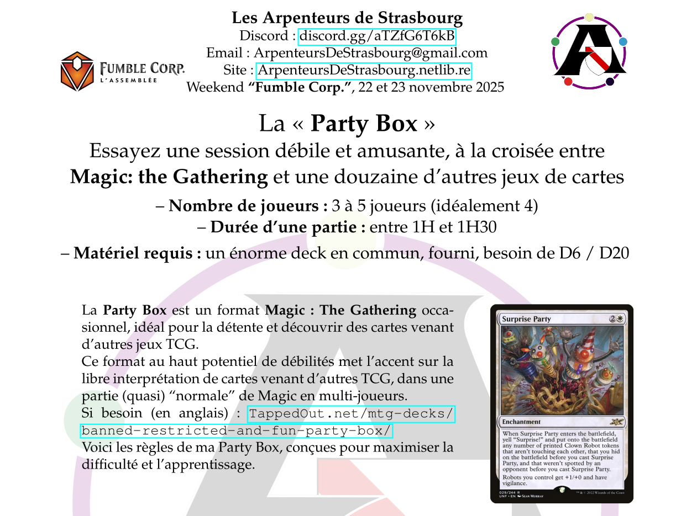
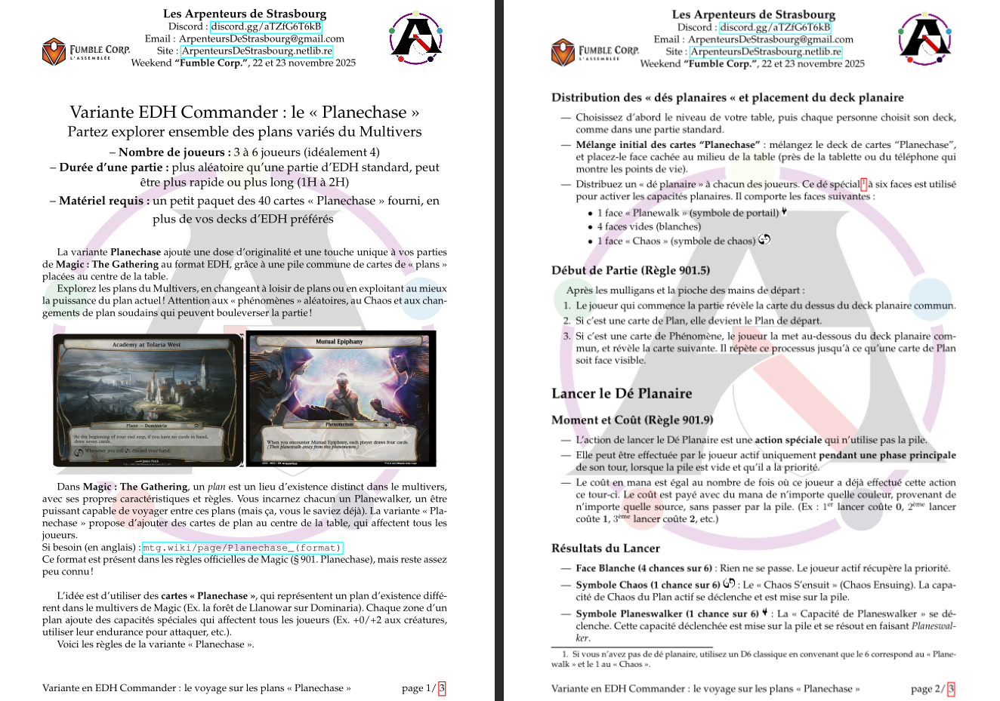
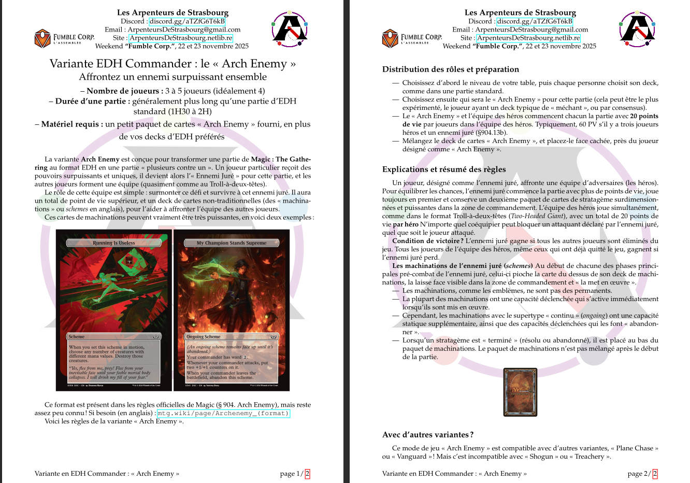
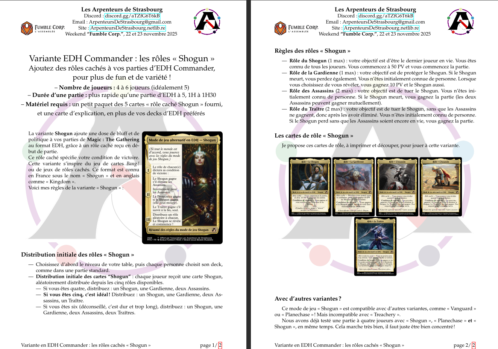
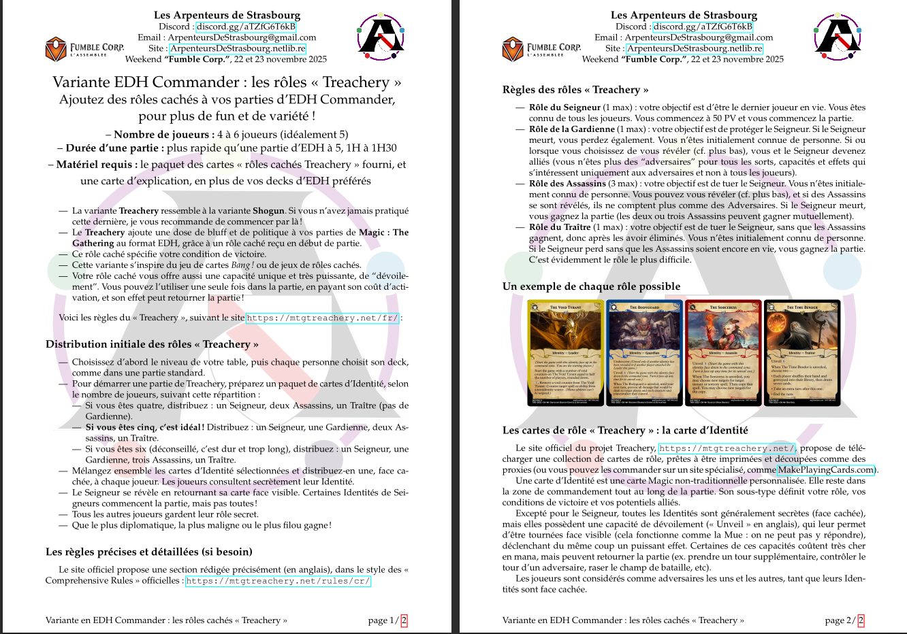

# Mes règles de variantes fun et amusantes à Magic the Gathering en LaTeX (pour la Fumble Corp 2025)

Ce dépôt GitHub héberge le code source en LaTeX, ainsi que les illustrations (JPEG et PNG) nécessaires à la compilation des documents, pour une série de petits documents PDF que j'ai produit en novembre 2025.
Ces documents servent à présenter mes règles de variantes fun et amusantes, à [**Magic: the Gathering**](https://mtg.wiki/), pour [l'événement Fumble Corp organisé par l'association éponyme, en novembre 2025](https://mtg.fumblecorp.com/).

Ce weekend, je serais / je suis / j'étais présent avec un stand au nom de l'association [des Arpenteurs de Strasbourg](https://arpenteursdestrasbourg.netlib.re/), pour faire découvrir des variantes originales de **Magic: The Gathering** aux visiteurs, et organiser des parties de Magic en format EDH (Commander) ou d'autres formats, avec des variantes amusantes.

## Auteur et remerciements

L'auteur de ces documents est [Lilian (Naereen)](https://github.com/Naereen/), un joueur passioné de **Magic: The Gathering** depuis 2003, actif à Strasbourg depuis 2021. Je suis secrétaire et membre actif de l'association des Arpenteurs de Strasbourg et de l'association Cartes Flambées, et un arbitre Magic certifié niveau L1 (Judge Academy en 2023, International Judge Program en 2024).

- Je tiens à remercier Vincent pour les relectures et suggestions d'amélioration des documents.
- Je tiens à remercier tous les joueurs et les joueuses avec qui j'ai testé ces variantes, et qui m'ont aidé à améliorer les règles, notamment en 2024 et 2025.
- Merci tout particulièrement à Mathieu de Vent Divin (pour les cartes Pictionary utilisées dans la « Party Box »), et aux copains de « Hero Quest » pour nos soirées qui finissent autour de la « Judge Tower ».

-----

## Un aperçu des documents

## Les formats fun et (plus ou moins) déjantés

### Judge Tower

La [Judge Tower]([Judge-Tower.pdf](https://mtg.wiki/page/Judge_Tower)) est une variante de jeu très exigeante, pour les mordus de règles Magic, d'interactions uniques et complexes.

Le document LaTeX correspondant est dans le fichier [Judge-Tower.tex](Judge-Tower.tex) et le PDF est là : [Judge-Tower.pdf](Judge-Tower.pdf).

### Party Box

La [Party Box](https://www.youtube.com/watch?v=g9ldDFKrSHc) est une variante de jeu très fun et sociale, idéale pour les joueurs qui veulent une partie déjantée.

Le document LaTeX correspondant est dans le fichier [Party-Box.tex](Party-Box.tex) et le PDF est là : [Party-Box.pdf](Party-Box.pdf).

-----

## Les variantes à ajouter à une partie d'EDH (Commander)

### Planechase

La [variante Planechase](https://mtg.wiki/page/Planechase) ajoute une dose d'originalité et une touche unique à vos parties de Magic: The Gathering au format EDH, grâce à une pile commune de cartes de « plans » placées au centre de la table. Ces plans influencent la partie avec des effets globaux, et les joueurs peuvent lancer un dé planaire pour provoquer des événements aléatoires, comme des changements de plan ou des phénomènes imprévus.

Le document LaTeX correspondant est dans le fichier [PlaneChase.tex](PlaneChase.tex) et le PDF est là : [PlaneChase.pdf](PlaneChase.pdf).

### Arch-Enemy

La [variante Arch- Enemy](https://mtg.wiki/page/Archenemy_(format)) ajoute lui aussi une dose d'originalité à une partie de Magic: The Gathering au format EDH, en faisant s'affronter une équipe de "héros" contre un "ennemi juré", qui sera surpuissant. L'ennemi juré dispose de points de vie supplémentaires et d'un deck spécial de cartes de machinations pour l'aider à affronter l'équipe des héros.

Le document LaTeX correspondant est dans le fichier [Arch-Enemy.tex](Arch-Enemy.tex) et le PDF est là : [Arch-Enemy.pdf](Arch-Enemy.pdf).

### Vanguard

La [variante Vanguard](https://mtg.wiki/page/Vanguard_(format)) ajoute des rôles uniques à chaque joueur, modifiant les points de vie initiaux, la taille de la main initiale et maximale, et offrant des capacités spéciales.

Le document LaTeX correspondant est dans le fichier [Vanguard.tex](Vanguard.tex) et le PDF est là : [Vanguard.pdf](Vanguard.pdf).

### Le Shogun

La [variante Shogun](https://mtg.wiki/page/Shogun) est une variante amusante, qui introduit des rôles cachés et des conditions de victoire asymétriques, en format EDH (Commander).

Le document LaTeX correspondant est dans le fichier [Shogun.tex](Shogun.tex) et le PDF est là : [Shogun.pdf](Shogun.pdf).

### Le Treachery

La [variante Treachery](https://mtg.wiki/page/Treachery) est une variante comme le Shogun, mais encore plus compliquée. Cette vaiante introduit ausi des rôles cachés et des conditions de victoire asymétriques, en format EDH (Commander), mais ajoute des capacités uniques et puissantes, que chaque joueur ne peut utiliser qu'une seule fois dans la partie, en se révélant.
Le site officiel de cette variante est [MTGTreachery.net](https://mtgtreachery.net/fr/).

Le document LaTeX correspondant est dans le fichier [Treachery.tex](Treachery.tex) et le PDF est là : [Treachery.pdf](Treachery.pdf).

-----

## Les formats fun en duel

### Le Dandân

La [variante Dandân](https://mtg.wiki/page/Dandân) est une façon bien particulière de jouer à Magic, en duel uniquement, avec un deck mono-bleu partagé, qui est très orienté « contrôle », et seulement dix exemplaires d'une unique créature, le « Dandân », qui meurt si vous ne contrôlez plus d'île, et ne peut pas attaquer l'adversaire s'il ne contrôle pas d'île.

Le document LaTeX correspondant est dans le fichier [Dandan.tex](Dandan.tex) et le PDF est là : [Dandan.pdf](Dandan.pdf).

-----

## Comment générer ces documents ?

- Compilez avec `LaTeX` (avec `pdflatex`), par exemple avec la commande `latexmk -pdflatex *.tex` dans le répertoire racine du dépôt GitHub, pour générer les fichiers PDF.
- Il faut avoir une distribution LaTeX complète installée, avec les paquets standards usuels. Rien d'hors du commun n'est nécessaire.

> Testé uniquement sur Ubuntu 24.04, mais devrait marcher sur d'autres Linux de la famille Debian. Probablement fonctionnel sur Windows avec WSL. Et sur Mac avec `brew` et `gnu make` installés.

-----

## :scroll: License ? 
Les documents LaTeX dans ce dossier sont publiés sous la licence [MIT License](https://lbesson.mit-license.org/) (fichier [LICENSE](LICENSE)).
© [Lilian Besson](https://GitHub.com/Naereen), 2025.

Le reste des fichiers (images, etc.) sont sous copyright de leurs auteurs respectifs.

The logos and images are the properties of their respective authors, mainly [Wizards of the Coast](https://magic.wizards.com/).

